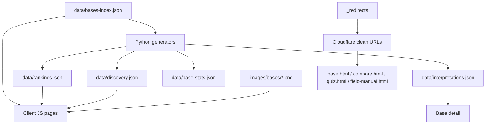

# 00 Executive Summary

## Scope and stance

This audit documents the current V1 implementation of ZombieBases without redesigning it. The briefing documents in the repository root describe product intent and V2 direction; the files under `audit/` record implementation evidence, discrepancies, coupling, hidden assumptions and migration risks.

## Current implementation at a glance

ZombieBases V1 is a static, client-rendered web application deployed as plain HTML/CSS/JavaScript. It uses committed JSON data, committed PNG images, build-time Python generators, Cloudflare Pages rewrites, and browser-side rendering for almost all dynamic behaviour.

## Key factual findings

* The canonical dataset is `data/bases-index.json`; it currently contains 111 bases, each with identity, taxonomy, prose, scores, comparison scores, coordinates and image fields.
* There is no framework, bundler, package lockfile, app server, database or server-rendered route layer. Pages fetch JSON at runtime and render in the browser.
* Base detail pages are served through a shared `base.html` shell and `js/base.js`; clean URL support is handled by Cloudflare `_redirects`.
* Homepage Explore, Rankings, Region rankings, Type rankings, Scenarios, Compare, Quiz and Field Manual are each separate HTML shells with page-specific JavaScript.
* Shared components exist as global browser objects rather than modules: slug routing, SEO helpers, card rendering, mobile navigation, footer, filter taxonomy and map creation.
* Overall score is stored, not calculated at runtime from the three headline categories. Ranking pages sort by stored overall score.
* Compare uses stored overall/headline scores plus four extended comparison dimensions, producing eight scoreboard rows total.
* Scenario rankings are generated by deterministic weighted formulas in `scripts/generate-discovery.py`, then rendered from `data/discovery.json`.
* Quiz recommendations are calculated client-side from hard-coded questions and profile logic in `js/quiz-questions.js` and `js/quiz-engine.js`, using browser localStorage for previous results.
* SEO is mostly client-applied metadata and JSON-LD, plus a generated XML sitemap, static `robots.txt`, canonical helpers and Cloudflare rewrites.

## Most important V2 migration risks

1. **Derived data is not centralized at runtime.** Rankings, discovery, interpretations, stats and page state come from separate generated JSON files and client code; V2 must preserve exact derived behaviour before changing storage.
2. **Clean URL semantics depend on Cloudflare rewrite order.** Root-level `/:slug` competes conceptually with top-level product routes and requires a reserved-route list in `js/slug.js`.
3. **Scoring has multiple meanings.** Stored overall scores, three headline categories, four comparison-only scores, scenario formula scores and quiz compatibility scores are separate systems.
4. **Content and presentation are tightly coupled.** HTML shells, JavaScript templates and CSS class names are closely intertwined; several components assume specific DOM IDs.
5. **Images rely on slug filename conventions.** Most image paths are inferred from slugs, with placeholders and some root duplicate PNGs.
6. **SEO is hydrated client-side.** Crawlers that do not execute JavaScript may see generic shell metadata for dynamic base/compare/list pages.
7. **Field Manual is static HTML content.** It is not data-driven; migration will need careful content extraction.

## Audit document map

* `01-repository-overview.md` — file layout, application architecture and dependencies.
* `02-site-map.md` and `03-page-inventory.md` — route and page inventory.
* `04-routing-and-cloudflare.md` — clean URL and rewrite behaviour.
* `05-component-inventory.md` — shared component inventory and duplication.
* `06-data-model.md` — source datasets and base schema.
* `07-scoring-engine.md` — score storage, comparison factors and generators.
* `08-search-filtering.md` — homepage, header and selector filtering.
* `09-rankings.md` — global, region, type and scenario ranking logic.
* `10-compare-system.md` — compare landing and result behaviour.
* `11-quiz-system.md` — quiz questions, profiles, algorithm and persistence.
* `12-field-manual.md` — Field Manual structure and behaviour.
* `13-assets-and-images.md` — media strategy.
* `14-seo.md` — metadata, sitemap, robots and structured data.
* `15-build-and-deployment.md` — scripts, workflows and deployment assumptions.
* `16-technical-debt.md` — factual debt register.
* `17-v2-risk-register.md` — migration risk register.
* `inventory.json` — machine-readable inventory of pages, assets, datasets and relationships.
