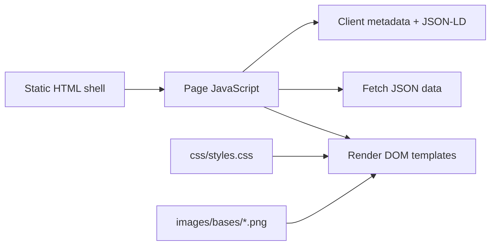
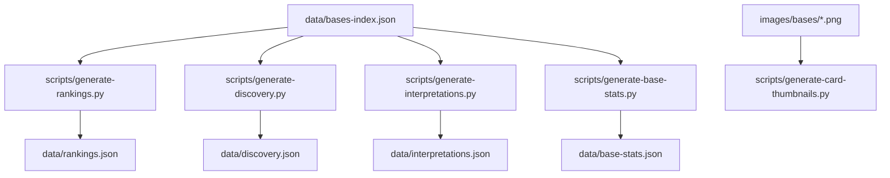

# 01 Repository Overview

## Root structure

| Path | Role |
|---|---|
| `README.md` | Audit briefing entry point; declares V1 code freeze and says root briefing documents are not audit findings. |
| `ZombieBases_V2_Product_User_Behaviour_Brief.md` | Product intent, user journeys and parity expectations. |
| `ZombieBases_V1_Technical_Context_V2_Rebuild_Specification.md` | Technical context and V2 direction. |
| `index.html` | Homepage / Explore shell. |
| `base.html` | Shared base detail shell for both query-string and clean base routes. |
| `compare.html` | Compare landing and compare result shell. |
| `rankings.html` | Global rankings shell. |
| `rankings-region.html` | Region rankings shell. |
| `rankings-type.html` | Type rankings shell. |
| `scenarios.html` | Scenario rankings shell. |
| `quiz.html`, `quiz/index.html` | Quiz shell and clean-page duplicate generated/copied by script. |
| `field-manual.html`, `field-manual/index.html` | Field Manual shell and clean-page duplicate generated/copied by script. |
| `js/` | Browser JavaScript; no module bundling, imported by `<script>` tags. |
| `css/styles.css` | Single global stylesheet for all pages and components. |
| `data/` | Canonical and generated JSON datasets. |
| `images/bases/` | Main base image assets, one PNG per base slug plus placeholder. |
| `scripts/` | Python generators and validators. |
| `tests/` | Node test files for compare and quiz logic. |
| `.github/workflows/sitemap.yml` | GitHub Actions workflow to regenerate sitemap on main. |
| `_redirects` | Cloudflare Pages rewrite rules. |
| `sitemap.xml`, `robots.txt`, `CNAME` | SEO and hosting support files. |

## Runtime architecture

V1 is a static application. It serves HTML shells, loads shared scripts globally, fetches JSON files from `/data`, and renders page content in the browser.

## Build-time architecture

Build scripts are Python and Node/npm script wrappers. Generated JSON is committed in the repository, and the build script additionally creates clean-page duplicates and generated card thumbnail copies.

## Dependencies

* `package.json` defines npm scripts only; it declares no runtime or dev dependencies.
* Browser dependencies are loaded externally where needed. The map uses Leaflet and marker clustering if available on `window.L`.
* Python scripts use the standard library only.
* Tests use Node's built-in test runner and load browser scripts through a minimal VM/window shim.

## Architectural assumptions

* JSON files under `data/` are publicly fetchable and treated as source-of-truth by client pages.
* Slugs are stable and usable as image filenames.
* Most dynamic pages can be represented by one static shell plus URL parameters or Cloudflare path rewrites.
* Browser JavaScript is available for rendering meaningful page content and metadata.
* Global script load order matters because components attach APIs to `window`.
