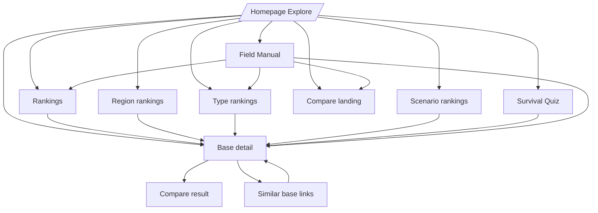

# 02 Site Map

## Public route families

| User-facing area | Primary V1 URL(s) | Shell | Data sources | Notes |
|---|---|---|---|---|
| Homepage / Explore | `/`, `/?q=...&region=...&type=...&sort=...&view=...` | `index.html` | `data/bases-index.json` | Client-side catalogue, filters, sorting, list/map toggle. |
| Base detail | `/base.html?slug=...`, `/base/:slug`, `/:slug` | `base.html` | `bases-index`, `rankings`, `discovery`, `interpretations` | Clean URL rewrite maps to the shell. |
| Compare landing | `/compare.html`, `/compare` | `compare.html` | `bases-index` | No selected pair shows symmetrical selectors and curated matchups. |
| Compare result | `/compare.html?a=...&b=...`, `/base/:slugA/vs/:slugB` | `compare.html` | `bases-index` | Clean compare rewrite is ordered before base detail rewrites. |
| Global rankings | `/rankings.html` | `rankings.html` | `data/rankings.json` | Highest stored overall score first. |
| Region rankings | `/rankings-region.html?region=...` | `rankings-region.html` | `data/rankings.json` | Dropdown selects region key. |
| Type rankings | `/rankings-type.html?type=...` | `rankings-type.html` | `data/rankings.json` | Dropdown selects type key. |
| Scenarios | `/scenarios.html?scenario=...` | `scenarios.html` | `data/discovery.json` | Scenario data is generated. |
| Quiz | `/quiz.html`, `/quiz`, `/quiz/` | `quiz.html` | `bases-index`, quiz JS config | LocalStorage stores previous result. |
| Field Manual | `/field-manual.html`, `/field-manual`, `/field-manual/` | `field-manual.html` | Static HTML content | JS builds TOC/progress and metadata. |

## Main journey graph

## Sitemap generation

`scripts/generate-sitemap.py` emits homepage, product pages, legacy HTML pages, clean base URLs and legacy `base.html?slug=` URLs. It uses git last-modified dates where available and writes `sitemap.xml`.

## Discrepancies and caveats

* The product brief describes Regions, Types and Scenarios as related ranked-list views. V1 implements Regions and Types as `.html` pages with query parameters, not clean nested ranking routes.
* Base clean URLs exist at both `/base/:slug` and `/:slug`, creating a reserved-route requirement.
* Some clean route equivalents exist only through Cloudflare `_redirects`; direct local filesystem serving without rewrites requires `.html` routes or generated duplicate directories for quiz/field manual.
