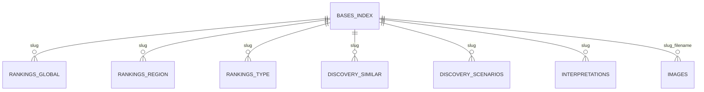

# 06 Data Model

## Canonical dataset

`data/bases-index.json` is the canonical V1 base dataset. It contains 111 base objects. Each object currently includes:

| Field | Shape | Usage |
|---|---|---|
| `name` | string | Display name, search, SEO. |
| `slug` | string | URLs, image convention, joins across generated datasets. |
| `type` | taxonomy key | Filters, rankings, labels, quiz type traits. |
| `region` | taxonomy key | Filters, rankings, labels. |
| `country` | string | Metadata display and search. |
| `description` | object | Summary, strengths, weaknesses. |
| `verdict` | object | Best use case and failure mode. |
| `survivalProfile` | object | Initial, short-term and long-term status labels. |
| `useCaseAndRisk` | object | Best use case and key risk. |
| `realityCheck` | string | Detail-page warning/framing. |
| `scoreNarrative` | string | Score explanation. |
| `scores` | object | Stored overall plus headline categories. |
| `comparisonScores` | object | Four extended compare dimensions. |
| `lat`, `long` | numbers | Map marker placement. |
| `image` | string | Explicit image path; otherwise slug convention is used. |

## Generated datasets

| File | Generated by | Purpose |
|---|---|---|
| `data/rankings.json` | `scripts/generate-rankings.py` | Global ranking, region ranking, type ranking and highlights. |
| `data/discovery.json` | `scripts/generate-discovery.py` | Similar bases, scenario rankings and scenario hints. |
| `data/interpretations.json` | `scripts/generate-interpretations.py` | Score bands, archetype labels and score shape summaries. |
| `data/base-stats.json` | `scripts/generate-base-stats.py` | Aggregate score counts, averages, highest/lowest by region/type. |

## Legacy/source dataset

`data/base-matrix-source.json` is a region-grouped source matrix of base names, slugs and types. It is not consumed by the main runtime pages discovered in this audit. It records 12 region groups and includes at least one slug (`uk-warehouse`) that is not present in the current canonical base dataset.

## Data joins

Slug is the universal join key:

## Taxonomies

Known base types include fortified structures, isolated landmasses, elevated strongholds, subterranean sites, institutional compounds, industrial sites, remote settlements and landmark structures. Known regions include Africa, East Asia, Eastern Europe, Middle East, North America, Oceania, Polar/Arctic, South America, South Asia, Southeast Asia, UK & Ireland and Western Europe.

## Schema enforcement

`validate-bases.py` checks required strings, score ranges, comparison score fields, related slug references and image expectations. The validator is the closest formal schema in V1; there is no JSON Schema file.
