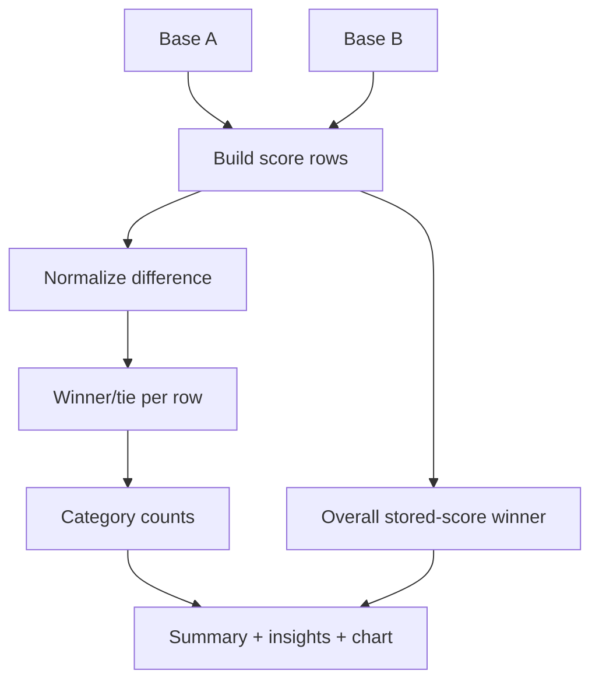

# 10 Compare System

## Entry points

Compare accepts:

* no selected bases: setup UI;
* query params: `?a=slug-a&b=slug-b`, with aliases `base` and `against` also recognized;
* clean route: `/base/:slugA/vs/:slugB`.

## Setup UI

Each side has an independent rich selector with:

* search/autocomplete;
* type filter;
* region filter;
* dynamic count;
* thumbnail/name/score/metadata options;
* selected base display;
* same-base prevention.

Curated matchups are generated from available bases and rendered as cards.

## Result algorithm

`buildComparisonResult(baseA, baseB)` is the central function. It builds row results for the eight score rows, determines per-row winners/ties, counts category wins, computes overall winner from stored overall scores, identifies largest advantages and prepares data for summary, radar chart and detailed scoreboard.

## Higher/lower score handling

Most rows are higher-is-better. Maintenance Burden is inverted by compare logic so lower burden becomes a better Maintenance Resilience result.

## Rendering

The result renders:

* heading and comparison statement;
* two hero cards with image, score and metadata;
* overall winner summary;
* category insights and radar/spider chart;
* detailed scoreboard;
* recommendation explanation;
* strengths/trade-offs;
* controls to change either base.

## Dependencies

* `data/bases-index.json` for all base and score data;
* `js/slug.js` for route parsing and URL generation;
* `js/seo.js` for metadata;
* `css/styles.css` for the complex compare layout.

## Risks and assumptions

* The compare recommendation is explainable only if stored scores and comparison score fields are complete.
* Overall winner is based on the stored overall row, not the count of category wins.
* Missing comparison scores render as unrated/even-like output and can weaken the verdict.
* All compare logic is client-side and exposed in the browser.
