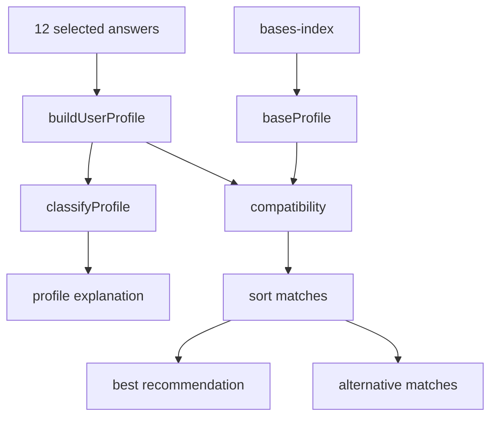

# 11 Quiz System

## Files

| File | Role |
|---|---|
| `quiz.html` | Quiz landing/questions/results shell. |
| `js/quiz-questions.js` | Seven axes and 12 questions with four answers each. |
| `js/quiz-engine.js` | Profiles, base trait mapping, user vector, compatibility and recommendations. |
| `js/quiz.js` | UI state, navigation, persistence, rendering and sharing. |
| `tests/quiz-engine.test.js` | Deterministic checks for recommendation behaviour. |

## Question model

The quiz has seven axes: defence, isolation, sustainability, resources, community, complexity and access. Each answer contributes weighted axis values. The UI requires a single answer before continuing and tracks progress through 12 questions.

## Recommendation flow

## Profiles

`js/quiz-engine.js` defines six survival profiles with names, icons, short descriptions, strengths, compromises and target traits. The result highlights the matched profile and lists all profiles with expandable details.

## Base profile construction

The quiz builds a base vector from stored scores and type traits. Type traits compensate for axes that are not directly stored as headline scores. This means quiz compatibility is partly score-driven and partly taxonomy-driven.

## Persistence

`js/quiz.js` stores completed quiz answers/result metadata in localStorage under a versioned key. Returning users can view previous result or retake the assessment. Stored results are reconstructed by rerunning the engine against current base data, so a dataset change can alter a previous result while preserving answers.

## Sharing

The share action uses Web Share API when available, with clipboard fallback. There is no server-side persisted/share-token result route in V1.

## Risks and assumptions

* Quiz content and scoring are hard-coded JavaScript, not external JSON.
* Previous results are browser-local only.
* Compatibility percentages are deterministic for the current code/data but can change if base scores/type traits change.
* Quiz result metadata and base detail metadata must remain consistent through shared base data.
